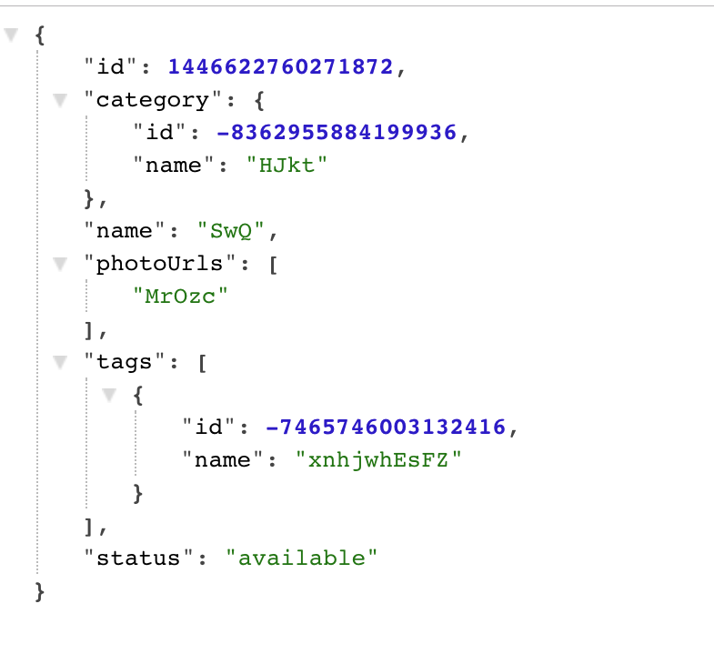

# koa-swagger-mock
## Introduce
It's a middleware for swagger-mock!

`npm run test` start test.js!

## Example
```
const Koa = require('koa');
const app = new Koa();
const KoaSwaggerMock = require('../lib/koa-swagger-mock');
const path = require('path');


const koaSwagMock = KoaSwaggerMock({
  apiPath: path.resolve(__dirname, '../json/example.json'),
  outputFile: path.resolve(__dirname, '../json/beifen.json'),
  paths: {
    '/pet/findByStatus': {
      name: 'responses',
      operation: 'get',
      response: 200
    },
    '/pet/:petId': {
      name: 'responses',
      operation: 'get',
      response: 200
    }
  }
});

app.use(koaSwagMock.routes());
app.listen(3000);
```
this is mock resp!



## API
### `KoaSwaggerMock({apiPath, outputFile, paths})`

* `api` - (*String*) - (required) - api can be one of the following.
    - A relative or absolute path to the Swagger api document.
    - A URL of the Swagger api document.

* `outputFile` - (*String*) - (optional) - Additional options to create the mock generator.
    -  A absolute path to output the backup of swagger.json

#### paths -(*Object*) - (optional)
* `key` - (*Object*) - proxy path
    - `name` - (*String*) - (required)
    - `operation` - (*String*) - (required)
    - `response` - (*Number*) - (required)

eg:
```
paths: {
    '/pet/findByStatus': {
      name: 'responses',
      operation: 'get',
      response: 200
    },
    '/pet/:petId': {
      name: 'responses',
      operation: 'get',
      response: 200
    }
  }
```
